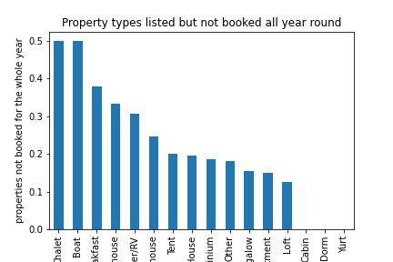

# How to maximize income from Airbnb?
## Based on AirBNB Seattle dataset from 2016

Many people would like to supplement their income by renting their homes or
starting a business on Airbnb. Unfortunately not everyone hosting on Airbnb
makes money, but using data can greatly increase your odds of making money.
Airbnb has recently gone public, this presents more opportunities for making
money on the Platform

WHAT IS Airbnb?
Airbnb is an online marketplace that lets people rent out their properties
to guests.
Since 2008, guests and hosts have used Airbnb to travel in a more unique,
personalized way. As part of the Airbnb Inside initiative, Airbnb has provided
the Seattle dataset which describes the listing activity of homestays in
Seattle, WA.

In this article we will analyze the data to come up with answers to the
following questions:
* If you are looking to buy a property to rent out on the Airbnb platform,
 what type of property should you obtain?
* If you are looking to rent out your primary residence only for a certain
the portion of the year which is the best time of the year?
* What amnesties should you provide to ensure that you can fetch a higher price
for your property and gain great review?
* Can machine learning be used to predict price and review scores?

Machine learning
: is an application of artificial intelligence (AI) that provides systems the
 ability to automatically learn and improve from experience without being
 explicitly programmed.
## Question 1: Property type
**Suppose you have an uncle nearing retirement, and they need a reliable and
sustainable source of income. They want to cash in their pension and buy a
property in the Seattle area, to rent out on the Airbnb Platform. They want
your advice on what type of property they should consider investing in on a buy
to let basis. Which of the following options should they not touch with a
ten-foot pole?**

About 50% of listed chalets and boats are not booked all year round. These  
 types of properties should be avoided at all costs. Your uncle will likely
make a loss and there will be no inheritance left for you.
More than 30% of listed Bed & Breakfast, Campers, and Treehouse are not booked  
all year long.   These types of properties should be avoided as well.
Lofts and apartments are least likely to go a whole year without a booking.
The uncle should invest in a Loft or apartment. With all the bookings he will
be getting, they will likely thank you with a fat inheritance.

## Question 2: Time of the year
**If you wanted to make some extra income by staying with friends and relatives  
while renting out your primary residence on Airbnb, which is the best time of
the year to do it.**

To maximize income from your side hustle, you should rent out your house for
 4 weeks in January and July.

## Question 3: Maximizing Price per person
**How can we predict the price that can be charged to rent a room on the
Airbnb platform?**
Having the right amenities can go a long way toward making guests feel more
comfortable and pampered in your property. You can charge higher prices if your
stands out from the crowd.

Using machine leaning A property with the following amenities is predicted to
fetch a higher price:
* *Cable TV*
* *Wireless Internet*
* *Air Conditioning*
* *Pool*
* *Kitchen*
* *Free Parking on Premises*
* *Gym*
* *Elevator in Building*
* *Hot Tub*
* *Heating*
* *Washer*
* *Dryer*
* *Smoke Detector*
* *Carbon Monoxide Detector*
* *First Aid Kit*
* *Fire Extinguisher*
* *Essentials*
They are basic items that every guest expects during their stay such as:
> * Toilet paper
> * Soap (for hands and body)
> * One towel per guest
> * One pillow per guest
> * Linens for each guest bed

## Question 4: Great reviews
**How can we predict the review scores that listings get on the Airbnb  
platform?**
Adding popular amenities to your property is the key to happy guests
and positive reviews.
A property with the following amenities is predicted to garner glowing reviews:
* *Wireless Internet*
* *Kitchen*
* *Gym*
* *Elevator in Building*
* *Buzzer/Wireless Intercom*
* *Heating*
* *Washer*
* *Dryer*
* *Smoke Detector*
* *Shampoo*
* *Hangers*
* *Hair Dryer*
* *Iron*

Airbnb suggests the following to ensure amenities are as guest-friendly as possible:

> If you have wireless internet Make sure it’s working and that guests know how to
log on.  
If you have air conditioning Let guests know where to find the controls and how
to use them—a laminated sign with instructions may be useful.  
Guests may want to cook all of their own meals during their trip, so make sure
to include dishware, pots and pans, and cooking utensils in the kitchen.  
If you have a parking spot for guests, be sure to provide any instructions
before they arrive.  
Safety features like smoke detector, carbon monoxide detector, first-aid kits
and  fire Extinguisher put everyone’s mind at ease

## Conclusion
After going through the Airbnb Seattle dataset from 2016, we can draw the
following conclusions.
The key to Maximizing profit on Airbnb is to ensure your calendar is full and
your profile only has great reviews.
One should rent out a loft, equipped with wireless internet, air conditioning,
gym, washer and drier. If you are renting out your home part time, you should
only list it in the months of January and June.
By having the right property and supplying the right amenities, you will have
happier guests, great reviews and more income.

To see more about this analysis, see the link to my Github available
[here](https://github.com/fmakayi/SeattleAirBNB).
