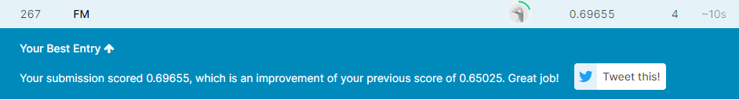

# Capstone Project
Farai Makayi

# Data Scientist Nanodgree
April 6th 2021

# Customer Segmentation Report

<a href='https://www.freepik.com/vectors/infographic'>Infographic vector created by stories - www.freepik.com</a>

#                         Definition

## *Project Overview*
Create a Customer Segmentation Report for Arvato Financial Services.

There are four data files associated with this project:

Udacity_AZDIAS_052018.csv: Demographics data for the general population of Germany; 891 211 persons (rows) x 366 features (columns).
Udacity_CUSTOMERS_052018.csv: Demographics data for customers of a mail-order company; 191 652 persons (rows) x 369 features (columns).
Udacity_MAILOUT_052018_TRAIN.csv: Demographics data for individuals who were targets of a marketing campaign; 42 982 persons (rows) x 367 (columns).  
Udacity_MAILOUT_052018_TEST.csv: Demographics data for individuals who were targets of a marketing campaign; 42 833 persons (rows) x 366 (columns).

## *Problem Statement*
For this project I will analyze demographics data for customers of a mail-order sales company in Germany, comparing it against demographics information for the general population.
I will use unsupervised learning techniques to perform customer segmentation, identifying the parts of the population that best describe the core customer base of the company. Then, I'll apply what I've learned on a third dataset with demographics information for targets of a marketing campaign for the company, and use a model to predict which individuals are most likely to convert into becoming customers for the company.

My main objective is to figure out which people in Germany are most likely new  clients of a mail order company selling organic products.
The goal is to help the client acquire new clients more efficiently.

### *The_K-Means_Algorithm_Evolution*
Clustering is one of the fundamental techniques forgetting insight on the underlying nature and structure of data. The purpose of clustering is organizing a set of data into clusters whose elements are similar to each other and different from those in other clusters. One of the clustering algorithms more widely used to date is K-means, because of its easiness for interpreting its results and implementation. K-means is a family of algorithms that were developed in the 1950s as a result of independent investigations.

### *Logistic Regression History*
First appearance of Logistic Function is seen in early 19th century.
Pierre François Verhulst published logistic function in 1838 under the name: Correspondance mathématique et physique.Verhulst was a Belgian mathematician and lived a short life between 1804 and 1849 in Brussels.
After Verhulst’s initial discovery of logistic function, the most notable discoveries were the probit model, developed by Chester Ittner Bliss in 1934 and maximum likelihood estimation by Ronald Fisher in 1935.
In 1943 Wilson and Worcester used logistic model in bioassay which was the first known application of its kind.
n 1966 Cox introduced multinomial logit model which became a step up for the logistic regression applications with the logit model.
In 1973 McFadden made a connection between multinomial logit model and discrete choice theory and the rest is history.

## *Metrics*

### Unsupervised Learning
Silhouette Coefficient.
Silhouette Coefficient or silhouette score is a metric used to calculate the goodness of a clustering technique. Its value ranges from -1 to 1.
1: Means clusters are well apart from each other and clearly distinguished.
0: Means clusters are indifferent, or we can say that the distance between clusters is not significant.

### Supervised Learning
Classification Report
A Classification report is used to measure the quality of predictions from a classification algorithm. How many predictions are True and how many are False.
The classification report visualizer displays the precision, recall, F1, and support scores for the model.

Confusion Matrix
It is a performance measurement for machine learning classification problem where output can be two or more classes.
The number of correct and incorrect predictions are summarized with count values and broken down by each class.

AUC - ROC Curve
A performance measurement for the classification problems at various threshold settings. ROC is a probability curve and AUC represents the degree or measure of separability. It tells how much the model is capable of distinguishing between classes. Higher the AUC, the better the model is at predicting 0s as 0s and 1s as 1s.

# Analysis

## *Data Exploration*
Each row of the demographics files represents a single person, but also includes information outside of individuals, including information about their household, building, and neighborhood.

The "CUSTOMERS" file contains three extra columns ('CUSTOMER_GROUP', 'ONLINE_PURCHASE', and 'PRODUCT_GROUP'), which provide broad information about the customers depicted in the file. The  "MAILOUT_TRAIN" file included one additional column, "RESPONSE", which indicated whether or not each recipient became a customer of the company. In the "MAILOUT_TEST" subset it has been removed; it is against that withheld column that the final predictions will be assessed in the Kaggle competition.

Five columns ('ALTER_KIND1','ALTER_KIND2','ALTER_KIND3','ALTER_KIND4','KK_KUNDENTYP','EXTSEL992') have more than 50% of the data missing, as a result there were dropped from the data frame.

## *Data Visualization*
  

              Figure 1: Customer and Population Age Distribution

  

              Figure 2: Customer and Population Gender Distribution  

# Methodology

## Unsupervised Learning

### *Data Preprocessing*

* Mixed Data types
  Columns 'CAMEO_DEUG_2015' and 'CAMEO_INTL_2015' had integer and string data types. String data types were corrected and the  columns converted to integer data type.
* Columns existing only in the customer dataset.
  The following columns were dropped since they only exist in one dataset:
  'CUSTOMER_GROUP', 'ONLINE_PURCHASE' and 'PRODUCT_GROUP'
* Missing values
  The following columns had more than 50% of their values missing therefore they were dropped from the data frame:
  'ALTER_KIND1','ALTER_KIND2','ALTER_KIND3','ALTER_KIND4','KK_KUNDENTYP','EXTSEL992'
* Columns not necessary for machine Learning
  The following columns were not necessary for analysis therefore they were dropped: 'LNR','CAMEO_DEU_2015','D19_LETZTER_KAUF_BRANCHE','EINGEFUEGT_AM','OST_WEST_KZ'
* Data Cleaning Function
  The 4 steps above were made into a function(clean_data) to clean the other three datasets
* Scaling
  Before scaling was done null values were dropped to avoid division by zero
  The scale and distribution of the data drawn was different for each variable so a standard scaler was used to standardize features by removing the mean and scaling to unit variance.

### *Implementation*
* Instantiate kmeans
    The following parameters were used
    init="random", n_clusters=6,
    the rest of the parameters were left as default

* Fit algorithm to features  
    Initialize random centroids  
    Calculate distances between the centroids and the data points  
    Compare distances between the data points and the centroids and take the smallest ones.  
    Assign centroid with smallest distance as cluster for particular data point.  
    Take mean values of coordinates of the data points and repeat until the coordinates of the centroids do not get updated anymore.

* Calculate Proportion of features which belong to different clusters.  
  Plot the data clusters
* Repeat the above steps for the population dataset

* Lastly I compared the clustering  results of the customer dataset and the population  dataset

### *Refinement*
The elbow method is used to find the correct value for the number of clusters k. This is achieved by  run several k-means, increment k with each iteration, and recording the SSE:
* Train a number of K-Means models using different values of K
* Record the average silhouette coefficient during each training
* Plot the silhouette score vs. number of clusters (K) graph
* Select the value of K for which silhouette score is the highest.  
Finding the correct values for k in the ranger 1 to 10 takes a very long time.

  

                      Figure 3: Elbow plot

### Results

#### *Model Evaluation and Validation*
The optimal K value is found to be 6 using the elbow method.
silhouette score for the customer data is 0.02
silhouette score for the population data is 0.02
The clustering is lightly dense and there are some overlapping clusters.

#### *Justification*
  

                        Figure 4: Customer clusters proportions

  

                        Figure 5: Population clusters proportions

More than 89% of features belong to clusters 3, 0 and 4 for the customer data set.
More than 84% of feature belong to clusters 4, 0, 2, and 1 for the population data set.
The marketing campaign should focus efforts on customers of cluster 4 and cluster 0 for maximum impact.

### Conclusion

#### *Reflection*
The process involved the following steps:
* Importing the required packages
* Importing the customer data into the notebook
* Data Exploration
* Preprocessing the data
* Building the model using the K-Means algorithm
* Analyzing and visualizing the built K-Means model  

I found the concept of making segmentation of the data challenging. This is not something that was covered during the coursework as result I had to do a lot of reading and research on the different methods to do customer segmentation.

#### *Improvement*
Use of density based clustering to minimize the effects of outliers.
Use of Principal component analysis to reduce the number of dimensions making the model more effective and efficient.

## Supervised Learning

### *Data Preprocessing*
I used the function created during data wrangling to clean the data.  
Missing values were replaced with the mean values.

### *Implementation*
I used the logistic regression classification algorithm to predict which individuals were most likely to respond to a mailout campaign.  
Step 1: Load data and perform a train test split.  
        The 'Response' column is the independent variable and the rest of the columns in the data frame make up the features.  
Step 2: Train classifier  
        * Instantiate the model, default parameters were used.  
        * Fit the model with training data.  
Step 3: Predict on test data.  
Step 4 Display test results.

### *Refinement*
Grid-search was used to find the optimal hyperparameters of the model which results in the most ‘accurate’ predictions using the AUC ROC score.

Because there is a large output class imbalance, where most individuals did not respond to the mailout, the metric needed to capture many of the actual customers as possible is AUC.  
Therefor the grid search was maximized for  'roc_auc'
The hyper parameters I tuned are as follows:
1. Penalty: l1 or l2 which species the norm used in the penalization.
2. C: Inverse of regularization strength- smaller values of C specify        stronger regularization.

The values I searched over are as follows:  
grid_values = {'penalty': ['l1', 'l2'],'C':[0.001,.009,0.01,.09,1,5,10,25]}

Results of tuning are as follows:  
tuned hyperparameters :(best parameters)  {'C': 0.09, 'penalty': 'l1'}

After tuning False negatives were reduced from 111 to 100.

### Results

#### *Model Evaluation and Validation*
Classification Report Summary:  
               &nbsp;   precision &nbsp; &nbsp;  recall &nbsp; &nbsp;  f1-score &nbsp;  &nbsp;  support  
          0   &nbsp;    0.99  &nbsp; &nbsp;  &nbsp;  &nbsp;   1.00   &nbsp; &nbsp;  &nbsp;  &nbsp;  &nbsp;    0.99   &nbsp;   &nbsp; &nbsp;   8714  
          1    &nbsp;     0.00   &nbsp;   &nbsp;  &nbsp;  &nbsp;    0.00  &nbsp;  &nbsp;  &nbsp;  &nbsp;     &nbsp;   0.00   &nbsp;   &nbsp;  &nbsp;     100  
          avg    &nbsp;     0.98   &nbsp;   &nbsp;    0.99  &nbsp;  &nbsp;  &nbsp;  &nbsp;  &nbsp;   0.98   &nbsp;   &nbsp;  &nbsp;  8814   
          total

Accuracy: 0.988654413433

Confusion Matrix Summary:
array([[8714,    0],  
       &nbsp;  &nbsp;&nbsp;  &nbsp;&nbsp;  &nbsp;&nbsp;  &nbsp;&nbsp;  &nbsp;&nbsp;  &nbsp;&nbsp;  &nbsp;&nbsp;  &nbsp;&nbsp;  &nbsp;&nbsp;  &nbsp;&nbsp;  &nbsp;&nbsp;  &nbsp;&nbsp;  &nbsp;&nbsp;  &nbsp;&nbsp;  &nbsp;&nbsp;  &nbsp;&nbsp;  &nbsp;&nbsp;  &nbsp; [ 100,    0]])

  

                    Figure 6: plot the roc curve for the model

  

                    Figure 7: screenshot of the Kaggle Leaderboard

K-Fold Cross Validation
 KFold was used to perform the cross-validation.    
 Parameters used are as follows:  
 k=10,and shuttle set to false.

 accuracy of each fold - [0.98468345813478553, 0.98876786929884275, 0.98604492852280468, 0.98468345813478553, 0.98638529611980941, 0.98570456092579983, 0.98638529611980941, 0.99081007488087136, 0.99081007488087136, 0.98433775961865855]
 Avg accuracy : 0.9868612776637038

 Based on the results of the cross validation, the results do not fluctuate very much therefor there is no overfitting and the model is robust.                 

#### *Justification*
By fitting the Logistic Regression model with the default parameters, we have a much ‘better’ model. The accuracy is 98.8% and at the same time, the Precision is 98%
The AUC for the ROC curve score was 0.65025 on the first submission and 0.69655 after tuning.
tuned hpyerparameters :(best parameters)  {'C': 0.09, 'penalty': 'l1'}

The recall after grid search  increased from 98% to 99%, the precision  increased from 97% from 98%.

### Conclusion

#### *Reflection*
In the project, a machine learning model was built  to help a mail-order sales company in Germany in identifying segments of the general population to target with their marketing in order to grow.

This was archived using the following steps:

Step 1.
The "MAILOUT" data was split into two approximately equal parts, each with almost 43 000 data rows.  
Step 2.
The model was trained  with the "TRAIN" partition, which includes a column, "RESPONSE", that states whether or not a person became a customer of the company following the campaign.  
Step 3.
I then  created predictions on the "TEST" partition, where the "RESPONSE" column was withheld.  

It was interesting to submit the results as part of the Kaggle competition to see  how my model measures up against fellow students.

#### *Improvement*
I can improve the modelling by exploring more classifiers such as Tree-Based classifiers which can learn rules from the data. Because of the large number of feature variable logistic regression is likely overfitting.

To see more about this analysis, see the link to my Github available
[here](https://github.com/fmakayi/Arvato_Project.git).
